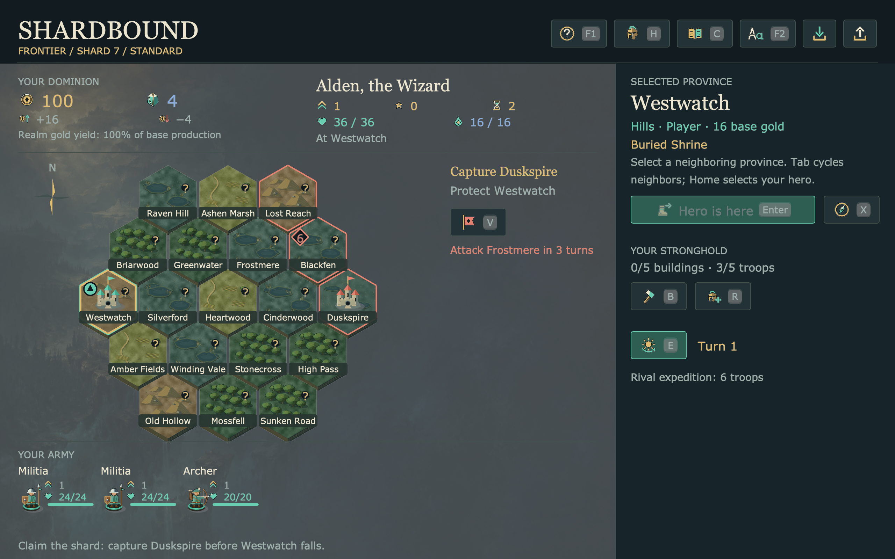
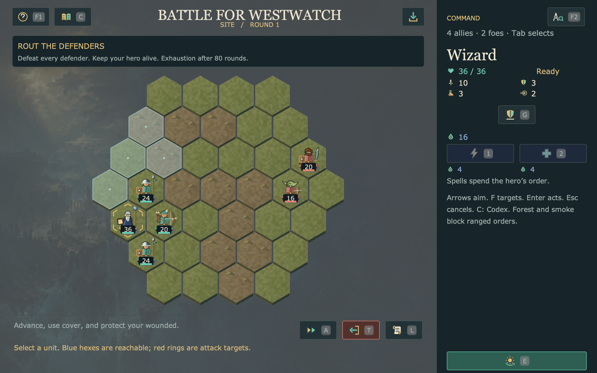
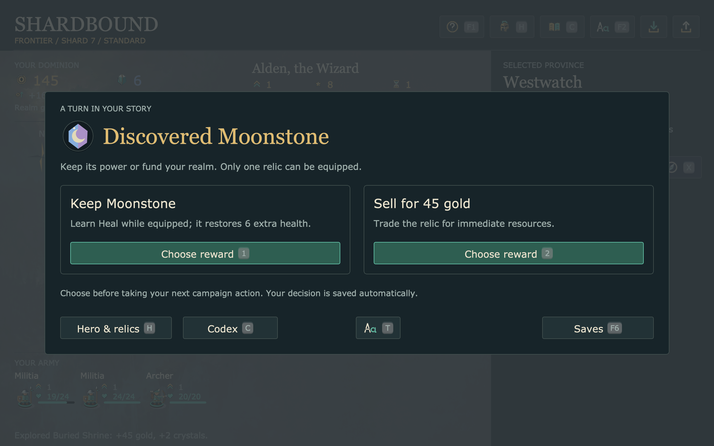

# A manual opening in motion

This 38.90-second [movie](gameplay.mp4) shows the current icon controls during
a fresh Wizard / Frontier / Standard opening on shard 7: map exploration,
movement, arrows, Bolt, Guard, a complete enemy turn, Heal, melee and retaliation,
victory, an earned Moonstone, and the return to the map.

The 1,167 frames come from the real pyglet framebuffer, reduced from Retina to
1280 × 800 and encoded at 30 FPS. Input uses actual native window events.
Sixteen public commands match detached model oracles; 33 native input
activations are recorded. Ordinary presentation frames preserve authoritative
state. Enemy actions play to completion without Auto-play or Finish playback.
This is an agent-directed opening, not an independent human playtest.

## Sound and timing

[gameplay-mix.wav](gameplay-mix.wav) reconstructs audio from the 53 emitted
backend events, exact shipping WAV hashes and effective playback gains. Those
events include 25 voice starts as well as volume and stop changes. Music and
effects share the video's fixed simulation clock. Natural native driver cleanup
does not truncate a cue when capture runs slower than real time; explicit stops
and music transitions still apply. Mono cues are copied equally to both stereo
channels. There is no spatialization or device latency model.

The 44.1 kHz, 16-bit stereo mix has peak 0.61801 and RMS 0.03019 at unity export
gain. No clip or final mix was normalized. The MP4 contains AAC encoded from
that WAV. This is reconstructed audio, not a microphone, loopback or hardware
playback recording. Listening quality and real-device timing remain unverified.
The fixed-rate video also makes no wall-time frame-performance claim.

## Reproduction and identity

```sh
uv run python tools/capture_eador_gameplay.py \
  --output /tmp/shardbound-new-movie --ffmpeg /absolute/path/to/ffmpeg
uv run python -m pytest tests/tools/test_gameplay_capture.py -q
```

Choose an empty output directory. The local capture helper requires an explicit
FFmpeg executable; it adds no game dependency or framework interface. Capture
and encoding run sequentially. Capture defaults to the 25% cooperative CPU
allowance and native verification to 30 FPS; the encoder uses one thread and
the same paced allowance. Temporary raw frames are removed and the Game closes.
The retained capture took 150.70 seconds wall and 37.79 seconds CPU before
encoding. This says nothing about the game's active 60 / inactive 15 FPS caps.

[capture.json.gz](capture.json.gz) records source revision **393359f**, the
uncommitted helper's exact hash, every relevant game/framework Python and asset
hash, input/order journals, complete before/after states, playback events,
audio events, chapter positions and original artifact hashes. Sources were
unchanged during capture. The helper was subsequently committed unchanged.
The encoder was FFmpeg 7.1 from an isolated development download; its executable
hash and complete command are in the receipt.

Four focused integration/regression tests pass in 8.51 seconds. A separate
single-thread readback decodes the entire video without errors and extracts
13 selected frames. The inspected action frames retain readable HP, damage,
spell costs and controls. The final blow opens the result immediately, as the
current game does; this recording adds no transition delay. Audio readback also
passes: AAC adds 734 padding samples at the end, with 0.99982 correlation to
the original mix at matching sample positions and a 0.61078 decoded peak.
The readback receipts and logs are retained alongside the original capture.

Selected original native stills are retained below. The remaining chapter
images remain represented in the movie and their original hashes in the
receipt. This supplements presentation evidence; it is not a refreshed package
or completion of the Early Access release criteria.




