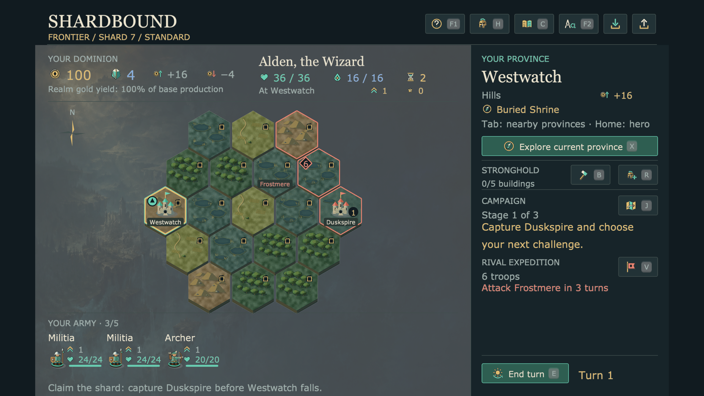
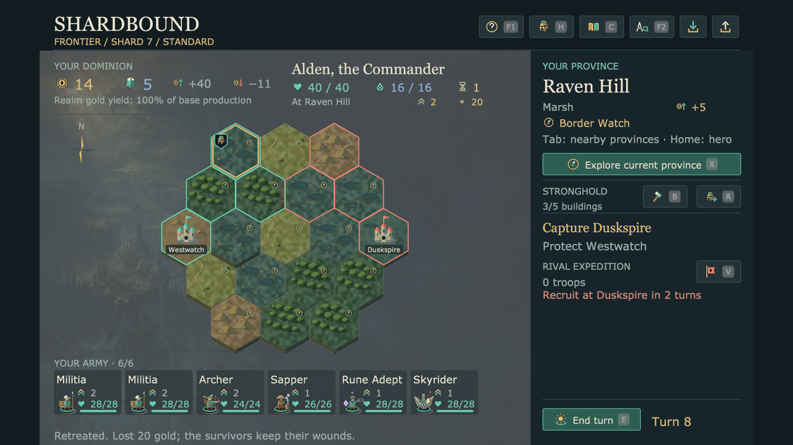

# Shard map polish: three further critique cycles

Accepted source: **3e1e75b**, following **dc6df32**. This source-game pass builds
on the [earlier name/layout changes](../shard-ui-2026-09-08/README.md). Ordinary
province names remain on demand; only capitals and announced rival destinations
keep permanent labels. The preserved Mac archive has not been rebuilt for this
additional pass.

## 1. Inspector hierarchy and a rejected symbol trial

The selected province now has a compact ownership heading, a smaller full name,
and separate terrain, income and adventure facts. The first attempt at replacing
repeated question marks used a tiny doorway. Native inspection showed that it
resembled an empty checkbox; it was rejected.



## 2. Connected terrain, a visible hero and separate army entries

Narrower gaps make the terrain read as a connected shard. This inset applies to
province rendering; battle and encounter tile spacing keep their existing value.
Adventure sites use the same compass symbol as Explore. A helmet banner locates
the hero. Subtle cards and wider gutters separate troop names, miniatures, ranks
and health, including a full six-troop army at 125% text.



## 3. Selected journey and exact income meaning

A short static arrow crosses the edge toward the selected adjacent province. It
appears only when the corresponding travel button is enabled, sharing the same
availability result. Province income explicitly says **base**, with a tooltip
explaining ownership and realm yield. All three opening travel directions were
captured and inspected.


## Verification

The [final native receipt](accepted/verification.json) records seven cases,
133 province selections, 133 hover checks, 454 input activations and four exact
public-command comparisons: Explore, retreat, End turn and invasion. Inspection
leaves saved game state unchanged. The cases cover Frontier, Ruins, an earned
Elderwild contract, a full army, saved encirclement and exhausted actions.

All **11 final PNGs were opened and inspected** at 100% or 125% reading size in a
1280×720 native window (the existing 1280×800 logical canvas is letterboxed).
An independent reviewer also inspected the full-army and encirclement layouts,
then accepted all three final travel cues and base-income labels without a
material concern.

**22 targeted integration tests passed** after cycle 2 (shard map, shard reading,
and scene journeys). The **seven shard tests passed again** after the final
changes. They include selection, exact purchases/orders, save/load, all earned
contract objectives, text settings, complete error messages and dense armies.
The [summary](summary.json) records the exact selections and timings. Tests ran
serially with a 25% cooperative CPU budget.

The final native job took **39.74s wall / 10.00s CPU**, about **25.16% of one
core**. Native input was paced at 30 FPS, and its Game/window closed successfully.
The final receipt's five source hashes match the accepted source exactly. Earlier
cycle receipts are retained in `cycle-1.json` and `cycle-2.json`; the two images
above are their retained critique representatives, not their complete capture sets.

Reproduce the final native check in an empty output directory:

```sh
/usr/bin/caffeinate -du .venv/bin/python tools/verify_eador_shard_look.py --output /tmp/shard-polish-review --cpu-percent 25
```

The visual commits change only Shardbound presentation and its verification.
They add no campaign rules, framework APIs, generated art assets or animations.
These checks establish the inspected source layouts and commands, not a fresh
packaged build, human playtest or complete Early Access acceptance.
