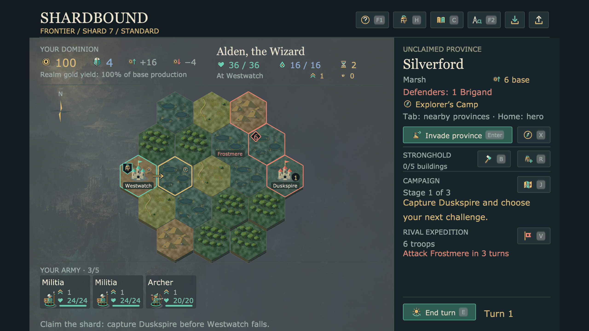
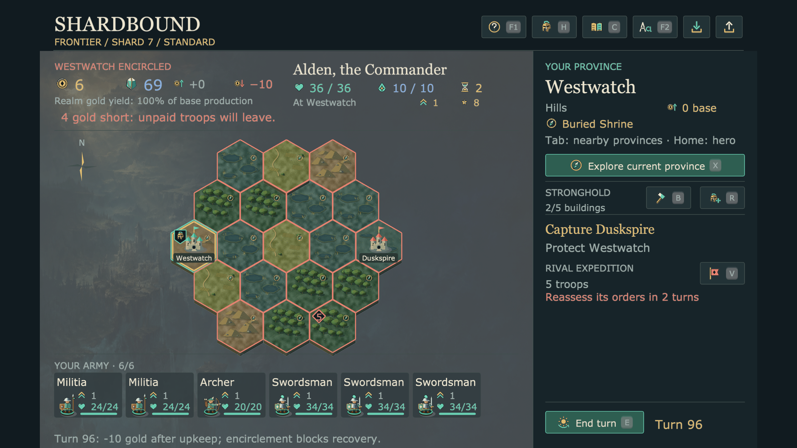
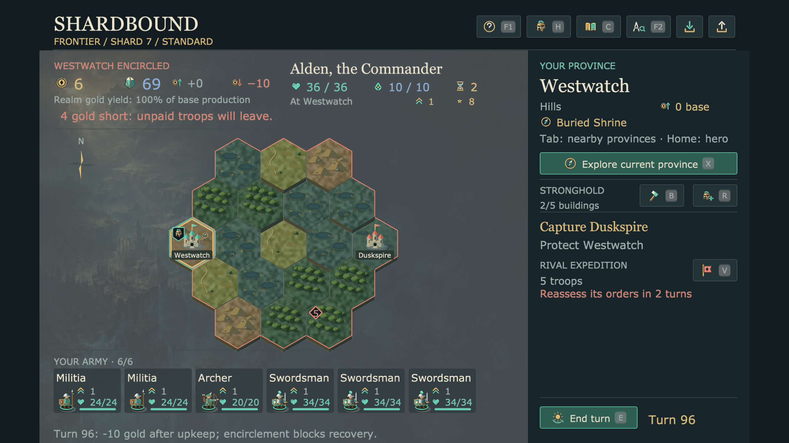
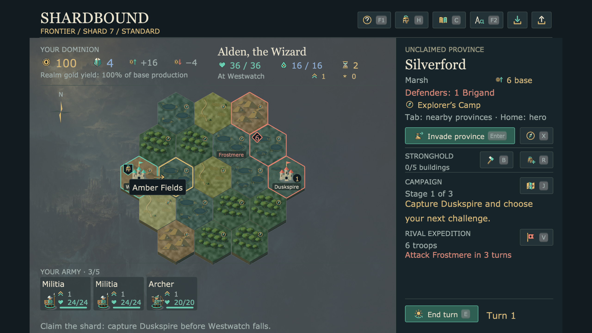
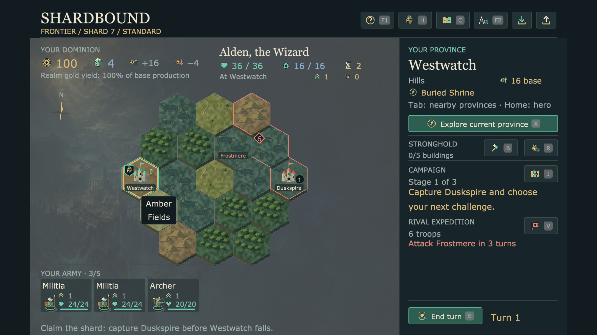
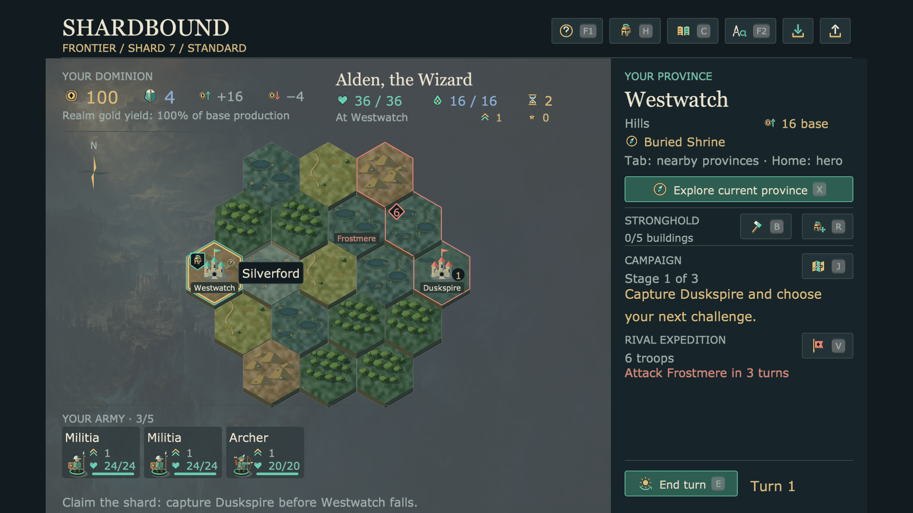

# Shard refinement: three critique and improvement passes

Accepted source: **3ea107e**. This continues the earlier
[province-name and layout work](../shard-ui-2026-09-08/README.md) and
[map/inspector polish](../shard-polish-2026-09-08/README.md).
The fresh baseline and each pass were captured in native pyglet at 1280×720,
with the same campaign states and 125% text. The final matrix also covers 100%.

## 1. Fewer repeated adventure markers

The opening repeated essentially the same compass across every province.
Owned adventures now remain visible, while other site markers appear when
their province is hovered or selected. The inspector retains the site's full
name. This exposes terrain without hiding a player's available adventures.




## 2. Territories instead of a bright grid

In the encircled state, coral outlines on every tile overwhelmed the landscape.
Color now follows territory frontiers; the terrain's dark seams retain individual
province boundaries. The full gold selection outline, hero banner, rival army
and strategic landmark names remain distinct. Frontiers are prepared on scene
refresh rather than recomputed every frame.




## 3. Names belong to the province being inspected

The previous Amber Fields hover covered Westwatch's castle and name. The
temporary label now sits over the pointed province. Phrases wrap between words;
the label accommodates the longest complete word so Silverford stays intact.
Ordinary province names still appear on demand. Capitals and the announced
rival destination keep their small permanent labels.





Two iterations were rejected: an opaque name panel initially consumed province
clicks, and a narrow label broke Silverford into “Silverfo” and “rd”. The first
was reproduced in a public-input regression and fixed with the existing
component input switch. The [word-breaking capture](03-rejected-word-break.png)
was rejected on inspection and its measured width corrected. No framework API
or campaign rule was added for these presentation changes.

## Verification

The [final native receipt](accepted/verification.json) passed **seven cases,
133 hover-then-click selections, 455 input activations and four exact public
orders**: Explore, retreat, End turn and invasion. Reading leaves campaign state
unchanged. The cases include Frontier, Ruins, an earned Elderwild contract,
exhausted actions, a full six-troop army and saved encirclement. All **12 final
PNGs were opened and inspected**. An independent reviewer accepted the territory
frontiers and both final hover-name examples.

The [22 targeted integration tests](integration-tests.log) passed after the
click correction. After the final word-width adjustment, the
[seven shard integration tests](final-shard-tests.log) passed again. These
cover actual orders, selection, save/load, reading settings, complete messages
and earned campaign/army states. The final test result is a subset rerun, not
seven additional tests. Initial failing placement and click regressions are
retained beside the passing results.

Jobs ran serially with a 25% cooperative CPU budget and native input at 30 FPS.
The final native run took **46.99s wall / 11.85s CPU**, about **25.22% of one
core**, and closed its window and Game. All five recorded source hashes match
the accepted commit. The intermediate cycle receipts record their original
four captures; only the critique representatives above are retained here.

Reproduce the final check in an empty output directory:

```sh
/usr/bin/caffeinate -du .venv/bin/python tools/verify_eador_shard_look.py --output /tmp/shard-refinement-review --cpu-percent 25
```

These are source-game changes. The preserved Mac package has not been rebuilt.
This pass verifies the displayed layouts and ordinary input paths; it does not
establish a human playtest, full accessibility compliance or native campaign PvP.
