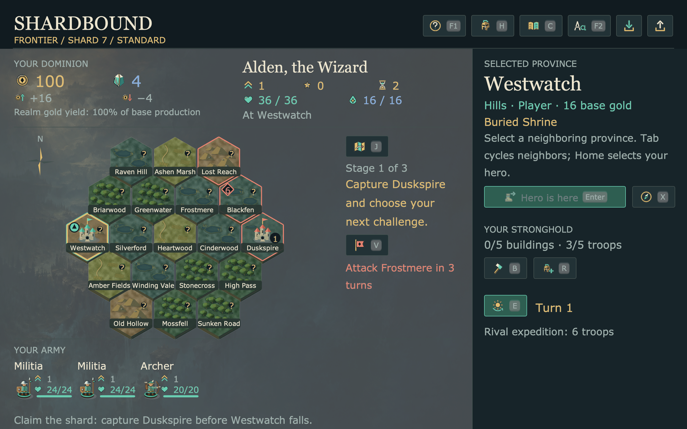
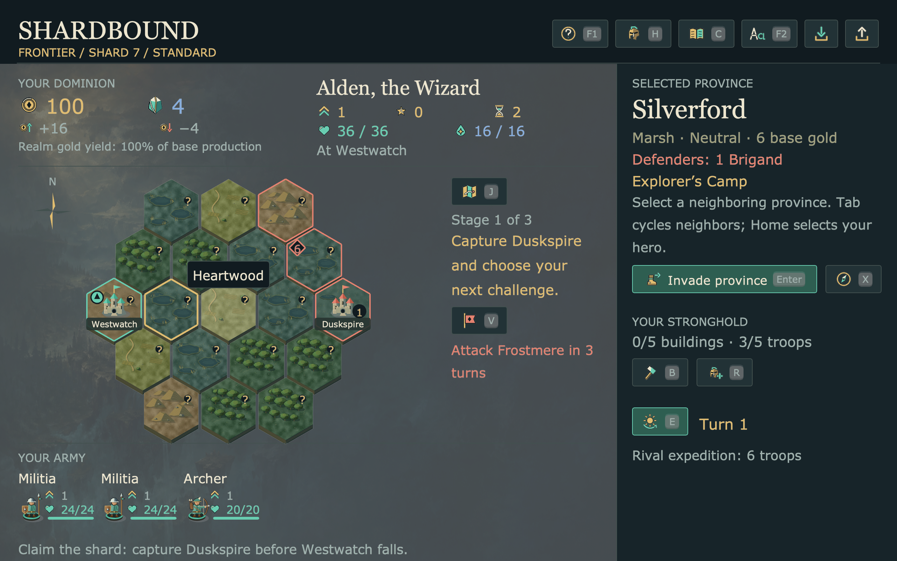
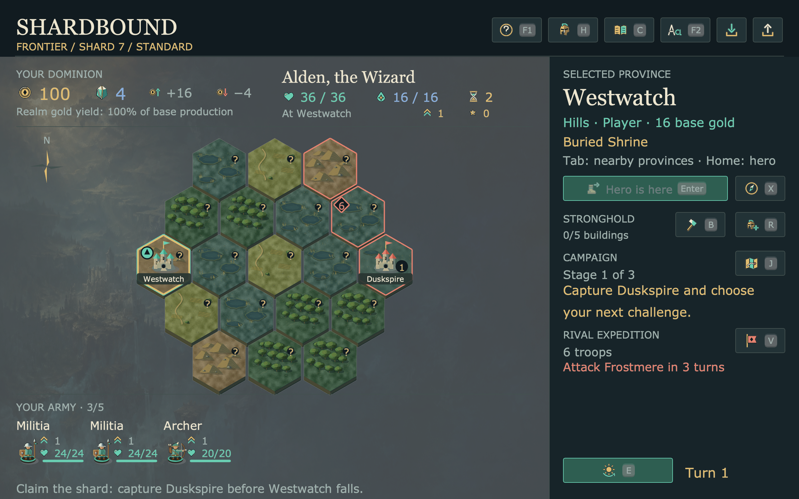
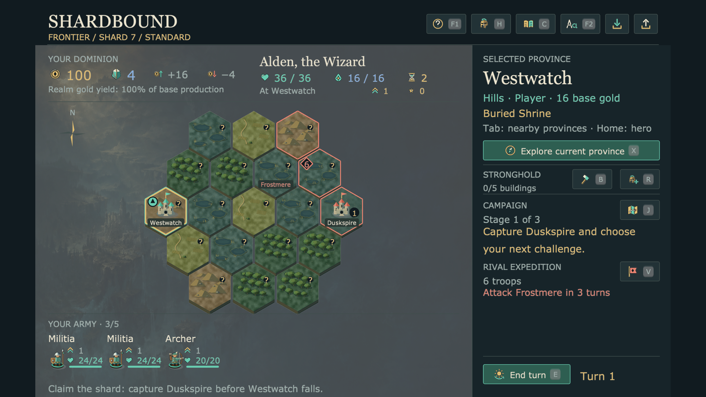

# Shard map: three critique and improvement cycles

Fresh native pyglet captures, 8 September 2026. This is source-game evidence;
the subsequent [bbb6349 Mac package](../shardbound-package-bbb6349/README.md)
includes these changes and verifies them in the extracted frozen app.
Accepted source: **ed27f24**, following the first two visual commits `ddf6d95`
and `763820a`. The accepted receipt records its pre-commit HEAD; its three
recorded source hashes match the committed files exactly.

## 0. Baseline — crowded terrain, divided attention

All 19 provinces carried dark nameplates. The objective occupied a narrow
column beside the board; at 125% its short opening objective wrapped into four
lines. The largest current-province control was the disabled “Hero is here”.



## 1. Names on demand — clearer terrain

Keep capital names as landmarks and reveal full names on hover or selection.
Keyboard Tab and Home still expose the selected province in the inspector.
The first native hover capture revealed a label incorrectly positioned at the
screen origin; the corrected capture below was inspected before committing.
Pointer movement rebuilds only the single hover label, and only on cell changes.



## 2. Board composition — a centered shard and wider objectives

Move the complete objective and rival forecast into the right inspector.
Consolidate the treasury and hero readouts into three rows while retaining
their exact values and explanatory icon tooltips. Center the map in the freed
area. In the captured 125% opening, hex size increases from 47.125 to 51.375
logical pixels, about 19% more tile area.

The first native pass caught the stronghold's troop count wrapping into the
campaign heading. Keep army capacity with the army strip instead. The corrected
pass has no overlapping reading labels or controls.



## 3. Contextual actions — a useful primary command

The current province presents a named Explore button; other provinces retain
Travel, Invade or Intercept, with the current-province exploration icon beside
them. End turn has a stable position at the foot of the inspector. Subtle rules
separate local orders, stronghold management and the campaign plan.

An announced rival march, attack or return retains a small red destination
nameplate, so its named warning remains locatable. At the opening this leaves three permanent map
names instead of nineteen. Hover labels stay below the summary and inside the
board's horizontal bounds.

The first complete native run exposed a tall, wrapped “Sunken Road” label in
the encirclement case. The last adjustment measures landmark names as single
lines and removes destination labels from unnamed waiting/reassessment orders.
The complete native check was repeated and all seven new frames inspected.



## Verification

**25 targeted tests passed**, including the shard reading, icon-control and
scene journeys. The seven shard tests passed again after the final landmark
adjustment. The [bounded random-input run](scene-input.json) passed one scene,
228 input activations and 223 state checks; it also exercised save/load,
results and replay. It ran before the final single-line label adjustment.

The [accepted native receipt](accepted/verification.json) proves five cases,
95 province selections, 95 hover checks, 324 input activations, unchanged state
through inspection and four exact public-command comparisons: Explore,
retreat, End turn and invasion. All labels/controls remain in bounds and clear
of other reading labels after each selection. The 1280×720 window uses the
game's existing 1280×800 logical canvas and letterboxing.

| Native capture | Result of visual inspection |
| --- | --- |
| [Solo, 100%](accepted/solo-opening-100-home.png) | Terrain is exposed, available action is named. |
| [Linked opening, 125%](accepted/linked-opening-125-home.png) | Full objective and rival warning fit in the inspector. |
| [Hover](accepted/linked-opening-125-hover.png) | One full name appears beside the pointed province. |
| [Selected neighbor](accepted/linked-opening-125-neighbor.png) | Selection and the invasion action describe the same province. |
| [Paid full army](accepted/paid-full-army-125-home.png) | All six names, miniatures and health readouts remain visible. |
| [Saved encirclement](accepted/saved-encircled-125-home.png) | Supply and desertion warnings remain prominent; no tall nameplate. |
| [Longest earned contract](accepted/longest-contract-125-home.png) | The full objective stays above rival details and End turn. |

The accepted native job took **29.19s wall / 7.35s CPU**, about **25.2% of one
core**, with 30 FPS input pacing and the 25% cooperative budget. Its window and
Game closed successfully. An independent agent reviewed the dense frames and
the final source adjustment without finding a remaining blocker.

Reproduce the bounded native check with:

```sh
/usr/bin/caffeinate -du .venv/bin/python tools/verify_eador_shard_look.py --output /tmp/shard-look-review --cpu-percent 25
```

All changes are in Shardbound presentation. Campaign rules and Saga2D APIs are
unchanged. The targeted model/UI journeys cover exact command results, selection,
save/load, 100%/125% reading sizes, earned full armies, encirclement and all earned
contract objectives. Screenshots establish the inspected layouts; they do not
establish full accessibility compliance or human playtest quality.
