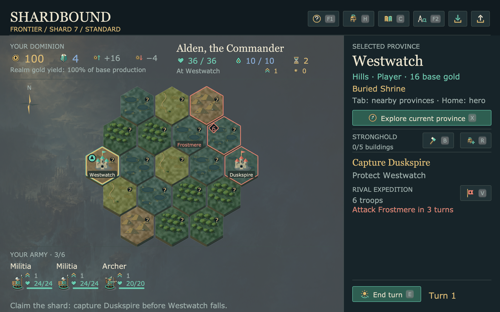

# Packaged shard visual refresh — 2026-09-08

Clean source **bbb63492b4e5a0190d0ec87e201cdc10b8348a79** is preserved in
`dist/shardbound-checkpoints/bbb63492b4e5/` as `Shardbound.app`, its Mac arm64
ZIP and build manifest. This package includes the
[three shard critique/improvement cycles](../shard-ui-2026-09-08/README.md):
names on demand, compact strategic landmarks, the centered board, consolidated
summaries and contextual Explore/Travel/Invade controls. Earlier packages remain
untouched. No additional game rules or framework API changed in this refresh.



## Artifact and checks

The ZIP is **49,280,904 bytes**, SHA-256
`45b6e8981adcd1817622c7af16095e68cf9a58533a7c429228f76bced765969d`.
All 241 source snapshot hashes match. A second extraction into the retained
checkpoint matches all 240 installed inventory entries and passes local ad-hoc
signature verification. The pinned builder uses CPython 3.13.2, PyInstaller
6.22.2 and hooks 2026.7.

The new packaged-control regression failed before implementation, then passed;
all **six packaging build/smoke tests pass** in 2.40 seconds. The native frozen
check uses 14 inputs to switch to 125%, read a full hover name, check its bounds,
click Explore, retreat, click End turn, and restore the exact original save and
preferences. Each of those three orders matches a public model command on a
detached copy. Builds now require this check to pass.

The extracted app also passes its campaign/battle/Guard save roundtrips,
settings apply/cancel/restart, About, guide, Codex and rival checks. All 18
installed WAVs decode and play with live mix/cleanup checks on the silent
driver. The external earned Control casualty warning is readable at 100% and
125%, leaves the State unchanged and reloads exactly. Its input hash is
`f9f46b60374def4ce333e12bc96333a27cd61dfacdb16075fe34ca498deee8d6`;
the input is the recorded `commands[80].before` from the earned Control journal,
with a trailing newline, without injected damage or rule changes.

Two complete linked campaigns run through the extracted frozen executable:

| Journey | App processes | Native inputs | UI save/reloads | Exact process continuations |
| --- | ---: | ---: | ---: | ---: |
| Direct three-shard completion | 4 | 467 | 8 | 3 |
| Capital loss, recovery, three-shard completion | 5 | 509 | 9 | 4 |

Both endings reload at 125% and return to the title screen. These are public
input regression journeys using the visible autoplay control for battles;
they do not establish human play quality or manual tactical mastery.

All **55 packaged frames** were visually checked using exact-hash
representatives. Root inspected the shard and recovery-specific frames; an
independent agent inspected the smoke screens and all 17 unique direct-campaign
frames. No actionable clipping or legibility defect remained in those frames.

A separate LaunchServices invocation of the retained app (`open -W -n`) passes
the smoke with working directory `/` and its own bundled assets. Ten of its
eleven frames exactly match the packaged smoke; root separately inspected the
changed About data-path frame. Across both launches, 66 frame records map to
38 inspected PNGs in `visual-review.json`. Duplicate PNGs are stored once;
`originals.json` records each original's hash and retained location.

## Reproduction and scope

From the clean detached checkout:

```sh
/usr/bin/caffeinate -du -t 1800 uv run --locked --isolated --python 3.13.2 --with-requirements packaging/requirements.txt python tools/build_eador.py --check-campaign --forecast-save /tmp/shardbound-shard-refresh-forecast.json
```

The nine campaign phase bodies took **163.06 seconds wall / 43.38 seconds CPU**,
about **26.61% of one core** at the requested 25% cooperative allowance and
30 FPS native input cap. This excludes imports/startup, report writing and
cleanup. PyInstaller is uncapped. Expensive jobs ran serially; all build,
application and verification processes ended.

This is a local Mac development artifact. Windows, clean-account launch,
artifact multiplayer connectivity, human listening/playtests and sustained
release acceptance remain open. The source contains the development-only
independent-realm foundation; selectable multiplayer remains shared-realm
co-op. This refresh does not make simultaneous campaign PvP playable.
**All overall G01–G19 release gates remain incomplete.**

JSON receipts and saves are losslessly compressed. `sha256.json` authenticates
the retained evidence files.
