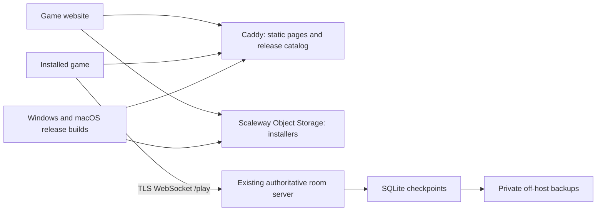

# Self-service game downloads and online play

Planning baseline: 2026-09-08. The implementation status below records what
has shipped since; the plan sections that follow are kept as the original
reasoning.

## Status (2026-09-08, later the same day)

Live: **https://games.tachyon-ai.eu/** — home page, per-game download/install
pages, invitation links (`/join/<game id>/<code>`), service status and the
release catalog at `/releases.json`, served by Caddy beside the room server.
Published through `tools/build_site.py` and `tools/deploy_online.py site`.

| Area | Delivered | Evidence |
| --- | --- | --- |
| Release contract | `releases/catalog.json` validated by `tools/release_catalog.py`; games fetch it when Multiplayer opens and offer **Open download page** for a newer build; the server rejects incompatible clients with a structured reason and the lobby shows **Update required**. | `tests/test_release.py`, `tests/test_online_menu.py`, `tests/tools/test_release_catalog.py` |
| Invitations | **Copy invite link** on the waiting screen; the link page shows the code, joining steps and the download for the visitor's OS. | `tests/test_online_menu.py`, live page |
| Warband | 0.1.0-preview.4 published (Windows installer, portable ZIP, Apple Silicon app) with invite links and update notices. | [warband-release.md](warband-release.md), `evidence/warband-distribution-2026-09-08/` |
| Tribes | 0.1.0-preview.1 published through the shared recipe `saga2d.packaging` (`tools/package.py`) and the Windows workflow. | [tribes-release.md](tribes-release.md), `evidence/tribes-distribution-2026-09-08/` |
| Shardbound | Versioned build, installer, online co-op diagnostic and verifying/publishing workflow; campaign rooms retained seven days and suspended to storage between visits. | `tools/verify_shardbound_package.py`, `.github/workflows/shardbound-windows.yml`, `tests/eador/test_online.py` |
| Operations | Hourly consistent SQLite backups with laptop pull (`deploy_online.py backup`); site publication separate from server activation. | [deploy/README.md](../deploy/README.md) |

Deliberate deviations from the plan below: installers are hosted on GitHub
Releases rather than Scaleway Object Storage (free, already verified, no extra
credentials in CI; the catalog can point elsewhere later), and Shardbound's
suspend/resume is the existing **Rejoin last room** with seven-day retention
rather than a separate campaign list. Still open and needing the owner:
Developer ID / Authenticode signing enrollment (packages remain unsigned and
un-notarized, with first-launch guidance on every page), external uptime
monitoring, a bounded load test before any capacity claim, native `warband://`
style handlers, a ready screen before RTS play, and a first-time-player trial
with a complete human-versus-human match.

## Recommendation

Build a small game website, standalone installers, and a consistent in-game online flow. Reuse the existing Scaleway multiplayer server. Do not build a separate launcher for the first release: each game already connects directly to the hosted service, and a launcher would add another application to install, sign, update and support.

Assume free downloads, Windows x64 and Apple Silicon macOS, two-player friend invitations, and the existing `games.tachyon-ai.eu` domain. Keep all three games in scope; deliver Warband first to establish the complete path, then Tribes and Shardbound. Linux and Intel Mac become advertised targets only after native package acceptance. Public room discovery is a subsequent milestone unless finding strangers is a launch requirement.

Success: a new player can choose a game, install it without Python or a terminal, open Online, and play with another person on a different network. Aim for under five minutes excluding download time. Returning players can recover their seat and find a compatible update without operator help.

## What already exists

| Area | Evidence and implication |
| --- | --- |
| Online hosting | All three games use `wss://games.tachyon-ai.eu/play`. The live `/healthz` returned `ok` during this planning session. This establishes reachability, not full match acceptance or capacity. |
| Server operations | Dedicated Scaleway Paris VM, Caddy TLS, systemd, bounded connections/rooms, SQLite checkpoints, candidate smoke tests and code rollback exist. Reuse [deployment tooling](../deploy/README.md). |
| Warband | [Preview.3](warband-release.md) has a published Windows installer and Apple Silicon app, with packaged multiplayer verification. Windows is unsigned; macOS is ad-hoc signed without notarization. Physical Windows GPU/audio and a full human-versus-human match remain open. |
| Shardbound | PyInstaller recipes and a Windows build workflow exist. That workflow explicitly marks Windows runtime unverified and retains temporary CI artifacts rather than publishing a player release. Selectable multiplayer is shared-realm co-op. The [concurrent PvP work](simultaneous-campaign-pvp.md) is changing and needs its own packaged acceptance before advertisement. |
| Tribes | Online competitive two-player play exists. No dedicated standalone installer/build workflow was found in the current packaging inventory. |
| Online UX | Create/join codes, automatic reconnect and saved private seats already exist. [Rooms currently expire after 15 minutes without both players](online-multiplayer.md); this does not provide overnight campaign continuation. |
| Compatibility | `saga2d/online.py` and `saga2d/server/` check protocol and game IDs. They do not negotiate a per-release client compatibility range. |
| Public competition | Current competitive snapshots contain the full world. A modified client can inspect fog-hidden information. Public competition needs player-specific state filtering. |

## Player experience and website resources

The home page presents three game cards with real screenshots, a short description, supported platforms and the actual online mode. Each game page includes:

- A prominent download button suggesting the OS, with explicit platform/architecture alternatives, version and download size.
- Three installation steps, verified system requirements, first-match instructions and a short gameplay clip from the shipping build.
- Online mode and player count; offline availability; release notes; known issues; credits/licenses; feedback/support link.
- Service status and actionable troubleshooting for server downtime, incompatible versions, expired rooms and lost seats.

Create reusable page templates and a small release catalog, rather than an e-commerce backend. Required resources are game icons/covers, inspected screenshots, gameplay captures, installers, release notes, platform guides, attribution files, and a brief data/retention notice reflecting actual service behavior. Reuse existing verified media when it matches the selected release.

In-game flow: **Online → Create room → Copy invite**, or **Online → Join room → Paste code**. Keep private seat tokens on the player's computer. Invitations contain only a public room identifier and game, never a resume token.

First ship HTTPS invitations such as `/join/warband/ABC123`: the page identifies the game and supplies the code and download. Room codes remain usable throughout installation. Next add an explicit **Open Warband** button through a game-specific registered URL handler, with equivalent handlers for the other games. No central launcher is needed. Validate handler arguments, allow only the intended game/room fields, and never turn a link into an arbitrary command or server address. Test both cold launch and an already-running app. A browser cannot reliably detect installation or silently install software; retain the download/code path.

Use a brief waiting/ready screen before starting play so the second player is not thrown into a live RTS while still reading instructions. Surface connection state and a clear rejoin action. For Shardbound, add **Suspend campaign / Resume campaign** with a proposed seven-day retention window, multiple remembered campaigns and a visible expiry date; both private seats must survive app and server restarts. Keep match TTL separate from campaign retention. No cross-device account recovery is promised in this first version.

## Installers, updates and release contract

Extend the proven Warband pipeline to all three games. Share packaging/release helpers where behavior is the same; retain game-specific assets and entry points. Avoid a framework-wide game registry redesign.

Windows: per-user installer, Start menu entry, uninstall, bundled runtime/assets and Authenticode signatures for executable payloads and installer. macOS: Developer ID signing, hardened runtime, notarization and stapled tickets; provide a drag-to-Applications DMG. Preserve saves/preferences on upgrade and ordinary uninstall.

Signing is a critical dependency for low-friction installation. Apple requires a developer account for Developer ID; Microsoft signing-provider eligibility depends on publisher identity and region. New signed Windows files can still produce reputation warnings, so do not promise their complete disappearance. See [Apple distribution guidance](https://developer.apple.com/developer-id/) and [Microsoft signing options](https://learn.microsoft.com/en-us/windows/apps/package-and-deploy/code-signing-options). Begin publisher enrollment early; use already suitable certificates if available.

Each immutable release records game ID, version, source commit, channel, OS/architecture, minimum tested OS, artifact URL/size/SHA-256, signing status, multiplayer compatibility ID and release notes. Promote one small catalog pointer only after acceptance; the website and games consume the same catalog. Never overwrite a versioned binary. Keep `preview` and `stable` distinct and advertise the evidence-backed channel.

Initially, an in-game update notice opens the correct installer page; reinstalling safely upgrades the game. This is a conscious additional step, not automatic updating. Reject incompatible online clients before allocating a seat, with an Update button; offline play remains available. Separate game rules/state compatibility from transport protocol. Require both clients and server to match the room's compatibility ID. Do not invalidate active rooms during publication: drain the prior server release or use an announced maintenance window with compatible checkpoints and tested restoration. Future transparent updates would justify a shared updater helper, before a full library client.

## Scaleway layout

Initially serve the small static site and catalog from the existing VM through Caddy, with explicit routes that preserve `/play` and `/healthz`; currently Caddy proxies every path. Download large binaries directly from a public-read, write-restricted Scaleway Object Storage bucket over its HTTPS endpoint so downloads do not compete with simulation work. A separate private bucket holds consistent database backups. Keep GitHub Releases as an optional mirror of identical accepted bytes; do not expose expiring CI artifact URLs to players.

Build on native Windows/macOS runners using the existing pinned recipes. Extend the current deployment tool with static-site publication and scoped object-storage credentials, without widening unrelated IAM policies. Separate website publication from server activation. Back up SQLite through a consistent snapshot/backup operation, not a raw copy of a live database. Exercise restoration and schema compatibility: code rollback alone cannot undo a database migration.

Add external uptime checks, room occupancy, simulation tick latency, memory/disk alerts, backup-age alerts and spend alerts. The configured 16-room/64-connection limits are safeguards, not a demonstrated player capacity. Load-test a representative game mix, especially Warband's 20 Hz simulation, before publishing a capacity claim. Return a friendly capacity message when full. A single VM remains a single failure point; move the static site off it or split game workers only when reliability/load evidence justifies it.

The existing documented VM + IPv4 + 20 GB disk estimate is approximately **€11.37/month before tax**, dated September 7; recheck the account estimate before changing resources. Current published Paris Standard Multi-AZ object storage is **€0.01606/GB-month**, with **75 GB/month free egress then €0.01/GB**. At 20 GB stored and 1,000 downloads averaging 200 MB, that adds roughly **€1.57/month**, assuming the full free egress allowance is available. Source: [Scaleway storage pricing](https://www.scaleway.com/en/pricing/storage/). Budget **€15–25/month for initial hosting** as a planning allowance, excluding signing, developer memberships, CI overages, domain renewal, tax and substantial traffic growth.

## Implementation sequence

Effort below is an engineering estimate for one implementer, conditional on package quality. Signing enrollment and human testing can extend calendar time.

| Milestone | Work and exit condition | Effort |
| --- | --- | --- |
| 1. Release contract | Freeze candidate versions/modes, agree supported platforms, inventory signing, define catalog and compatibility handshake; test old-client refusal and current-client create/join. Begin publisher enrollment. | 1–2 days |
| 2. Warband complete journey | Website template, real content, bucket/catalog, trusted installer flow, update notice, code-based invite page. Clean Windows and Mac users download and finish a match over different networks. | 3–5 days |
| 3. All three games | Tribes packaging/CI; finish Shardbound installer/runtime acceptance; game pages/guides; consistent Online/rejoin UX; Shardbound suspended campaign recovery. Advertise only verified multiplayer modes. | 4–7 days |
| 4. Launch verification and operations | Ready/invite polish, backups/restore, compatibility-aware deployment, bounded mixed-game load, download integrity, support/status, fresh-player trials and fixes. | 2–4 days |
| 5. Convenience follow-up | Native invite links and shared updater helper if install/update observations justify them. | Estimate after milestones 2–4 |

Total first-release engineering allowance: **10–18 working days**, plus external enrollment and playtest availability. Website alone is a small part; trustworthy packages and cross-platform multiplayer acceptance dominate. Broad Shardbound gameplay/early-access completion remains governed by its existing criteria and can extend its release date.

## Verification and launch gates

Use integration tests for code changes, following the repository's `tdd` skill. Verify actual downloaded installed executables, not just source runs. Each advertised game/platform must pass clean-account install, launch, fonts/assets/audio, offline play, online create/join, two-network cross-platform play, disconnect/rejoin, quit/relaunch, update with saves retained, and uninstall behavior. Inspect real game and website screenshots and exercise native input. Include a complete human-versus-human match; automated socket checks alone do not establish first-player usability.

Test an obsolete client, server downtime/full capacity, an expired invitation, invalid private-seat recovery, interrupted download, and publication rollback. Restore backed-up campaign state into a replacement server and verify both players resume. Check anonymized/public status and invite pages do not expose resume tokens or private game state. Run a small first-time-player trial: record installation failures, time to first match and points requiring help, then fix them before wider promotion.

Prepare all release artifacts, evidence and deployment changes before requesting publication approval. This planning task does not authorize publishing a website, creating paid resources or changing the live server. No such actions were taken.

## Public discovery and the launcher decision

If players should find strangers, add public/private room visibility, an opt-in waiting-room browser filtered by game and compatibility, nicknames, ready/cancel controls, expiration and rate limits. Keep rooms private by default. Do not expose private room codes in discovery. Add player-view filtering for fog-hidden state before promoting competitive public play; validate both secrecy and rendering/reconnect behavior. Public chat, ranked matchmaking, friend lists and account recovery introduce separate identity/moderation work and are outside the first release.

A shared launcher becomes worthwhile if observed friction is predominantly repeated multi-game installs and updates, or players explicitly need a library and cross-game presence. The existing release catalog can support it later. It does not solve signing, multiplayer hosting, game compatibility or public-player discovery by itself. Deliver and measure the complete website-to-match journey first.
